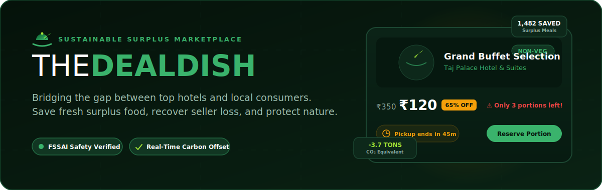

<p align="center">
  
</p>

# TheDealDish 🍽️💚

### Fostering a Sustainable Tomorrow — One Deal at a Time

**TheDealDish** is a premium, responsive Single Page Application (SPA) designed to bridge the gap between top hotels/restaurants and local consumers. The platform enables hotels to list fresh, high-quality surplus meals (such as buffet extras, pastries, or daily specials) at deep discounts (up to 70% off) shortly before closing hours. 

By connecting surplus kitchen inventory with hungry consumers, TheDealDish reduces food waste, lowers carbon emissions, saves consumers money, and **recovers revenue for sellers to prevent financial losses on unsold fresh food.**

---

## 🌟 Key Features

### 👤 1. Customer Portal (Browse & Reserve)
* **Real-Time Surplus Catalog:** Browse discounted deals nearby (Biryani, Pastries, Main Courses, Cold Brews).
* **Advanced Filtering:** Filter by keyword search, food category (Vegetarian, Non-Vegetarian, Bakery, Beverages), and local district.
* **Instant Reservation Lock:** Reserve portions instantly to lock in your discount.
* **Secure Pickup QR Codes:** Generates a secure QR code for verification at the hotel counter.
* **Ecosystem Stats & Earth Impact:** Interactive counters showing saved meals, prevented CO₂ emissions, and consumer savings.

### 🏨 2. Hotel Partner Portal (List & Verify)
* **Business Registration:** Hotels can register with their name, address, contact, and closing times.
* **FSSAI Food Safety Compliance:** Mandatory 14-digit FSSAI licensing input to ensure quality control.
* **Surplus Publishing:** Easily create active listings by inputting item names, categories, original menu prices, discount rates, quantities, and pickup windows.
* **Collection Management:** Real-time dashboard to manage pending pickups and verify orders via customer QR codes.
* **Revenue Recovery & Loss Prevention:** Turn potential food waste and raw material write-offs into recovered revenue by selling surplus stock close to closing hours.

### 🛡️ 3. Administrative Console (Audit & Verify)
* **FSSAI Auditing Queue:** Administrators review submitted hotel registration details and FSSAI credentials.
* **Merchant Activation:** Approve or reject registrations to keep the marketplace safe and regulatory-compliant.
* **Platform Analytics:** Real-time monitoring of registered partners, pending verifications, and cumulative carbon offsets.

---

## 🔑 Demo Accounts & Credentials

To explore the different portals, you can log in using these pre-seeded demo accounts:

| Portal Role | Email Address | Password | Functionality |
| :--- | :--- | :--- | :--- |
| **Consumer** | `customer@thedealdish.com` | `customer123` | Browse, filter, reserve deals, view active pickup QR codes. |
| **Hotel Partner** | `taj@thedealdish.com` | `taj123` | Add surplus deals, review orders, manage active listings. |
| **Platform Admin (Secret)** | `admin@thedealdish.com` | `admin123` | Directly logs in, shows the hidden Admin Panel in header. |

> [!NOTE]
> **Admin Panel Security:** To maintain platform security, the Admin role option is hidden from the public Sign In role selector, and the Admin Panel link is hidden from the header and footer. To log in as Admin, simply input the admin email and password above and submit the form directly. The app will auto-detect the credentials and log you in.

---

## 💻 Tech Stack

* **Frontend Core:** Semantic [index.html](file:///D:/gvp%20codes/thedealdish/index.html), Vanilla ES6 JavaScript OOP-driven Single Page Application engine in [app.js](file:///D:/gvp%20codes/thedealdish/app.js).
* **Styling (CSS):** Custom modern [style.css](file:///D:/gvp%20codes/thedealdish/style.css) featuring Emerald Green & Soft Sage color system, responsive grid layouts, and glassmorphic panels.
* **Database (Emulated):** Local storage state machine (`localStorage`) for persistence across sessions.
* **Typography:** Custom fonts via Google Fonts (`Outfit` and `Inter`).
* **Icons:** FontAwesome v6.4.0.

---

## 🚀 Quick Start

1. **Clone/Download the repository** to your local drive.
2. Open the main directory and launch [index.html](file:///D:/gvp%20codes/thedealdish/index.html) directly in any modern web browser.
3. Alternately, serve the folder locally using your preferred local server extension (e.g., Live Server in VS Code) or run a simple Python server:
   ```bash
   python -m http.server 8000
   ```
   *Then access the app in your browser at `http://localhost:8000`.*

---

## 📜 Legal & Compliance

The platform features built-in legal policies accessible from the footer, including:
* **Privacy Policy:** Data collection scopes for consumers and audited hotels.
* **Terms of Service:** Guidelines regarding reservation cancellation windows and surplus listing parameters.
* **Cookie Settings:** Details on functional `localStorage` browser settings.
* **FSSAI Rules:** Platform regulations enforcing valid safety licenses before restaurant activation.

---

## 🔄 Documentation & Policy Synchronization

To ensure that any updates to the website features, credentials, or policies are immediately reflected in our developer documentation and legal modals:

1. **AI Agent Rules:** Project-level rules are defined in [.antigravity/rules.md](file:///D:/gvp%20codes/thedealdish/.antigravity/rules.md) and [.agents/rules.md](file:///D:/gvp%20codes/thedealdish/.agents/rules.md). AI coding assistants (like Google Antigravity) will automatically inspect and update `README.md` and the legal modal definitions in [app.js](file:///D:/gvp%20codes/thedealdish/app.js) whenever modifying the website logic.
2. **Git pre-commit Hook:** A Git pre-commit hook is set up at [.githooks/pre-commit](file:///D:/gvp%20codes/thedealdish/.githooks/pre-commit). It checks if you have modified website code files ([index.html](file:///D:/gvp%20codes/thedealdish/index.html), [style.css](file:///D:/gvp%20codes/thedealdish/style.css), [app.js](file:///D:/gvp%20codes/thedealdish/app.js)) without staging corresponding documentation updates (`README.md` or legal modal text in [app.js](file:///D:/gvp%20codes/thedealdish/app.js)).
   * If not already active, enable the hook in your local checkout:
     ```bash
     git config core.hooksPath .githooks
     ```

---

*“Every single meal saved keeps roughly 2.5 kg of CO₂ equivalent emissions out of the atmosphere. Your choices make a difference!”* 🌍
